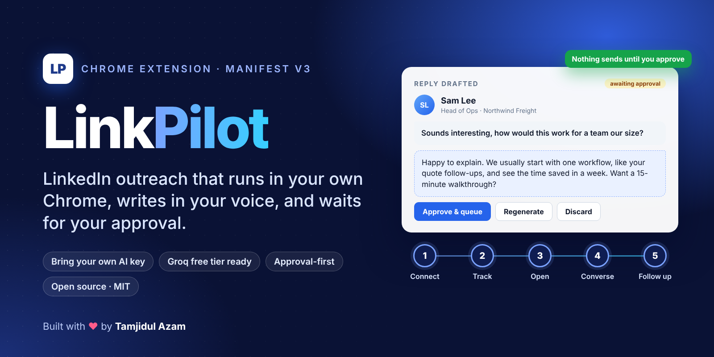
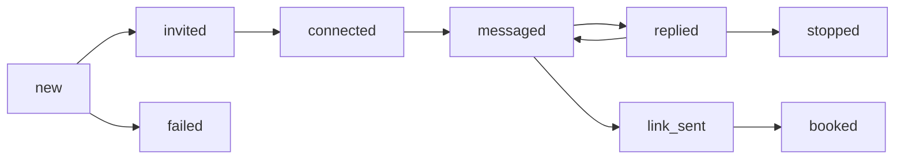
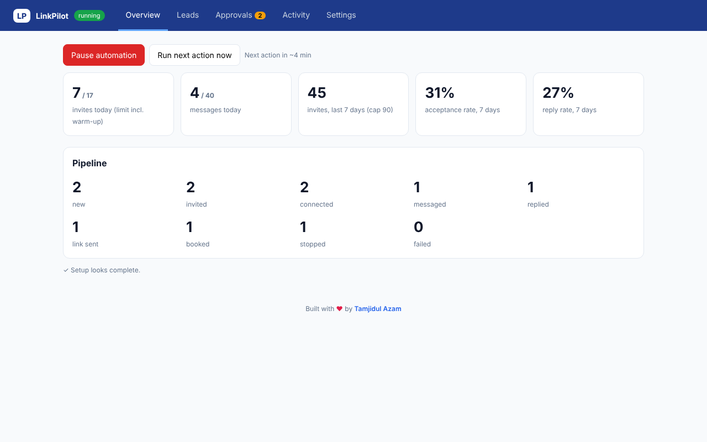
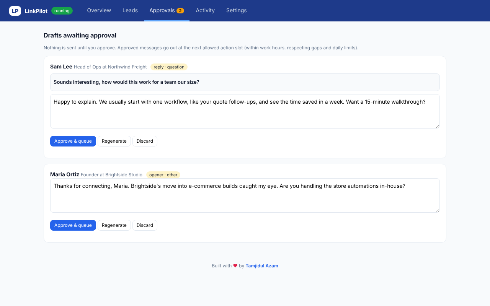
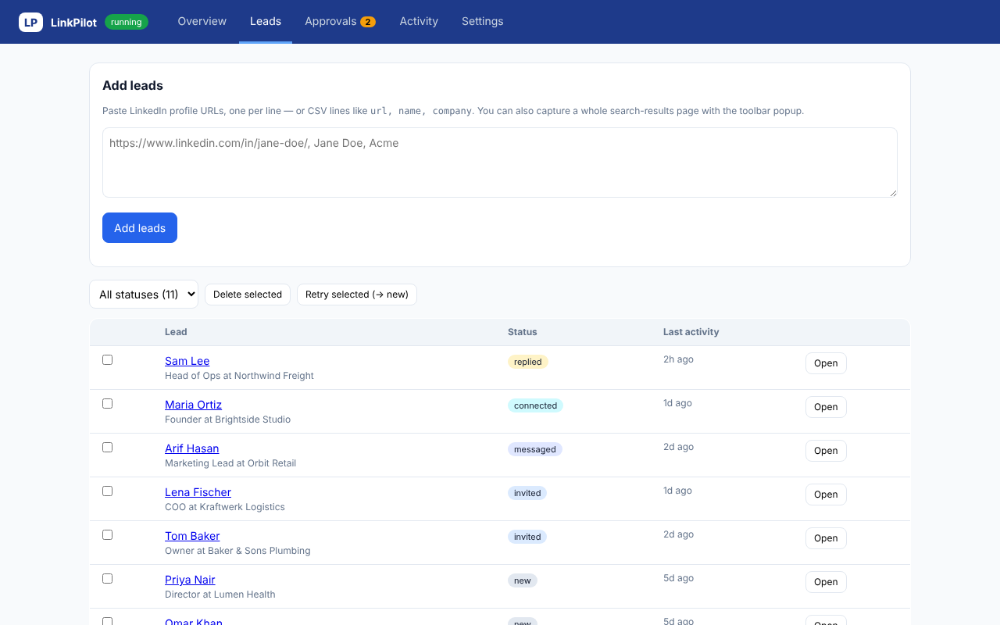
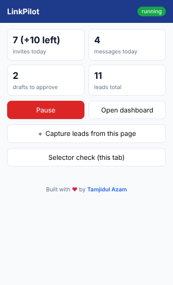

<p align="center">
  
</p>

# LinkPilot: LinkedIn AI Outreach for Chrome

<p align="center">
  
  
  
  
  
</p>

**LinkPilot is a Chrome extension that does LinkedIn outreach from your own logged-in browser.** It sends connection requests, notices when they are accepted, drafts openers, replies and follow-ups with the AI model **you** choose, and waits for your approval before anything goes out. No servers, no per-seat subscription: you bring your own API key (the Groq free tier works).

> **Status: v0.2.0, not yet run against live LinkedIn.** The logic (limits, scheduling, AI handling, safety rules) is unit-tested, but LinkedIn's page markup changes often, so the CSS selectors need a quick tune on first run. Read [Safety](docs/SAFETY.md) before you start, and begin with **Assist mode** on 2 or 3 leads.

## Install

```bash
git clone https://github.com/meshimul/linkpilot.git
```

1. Open `chrome://extensions` and switch on **Developer mode**.
2. Click **Load unpacked** and select the **`extension/`** folder from the clone.
3. Pin the LinkPilot icon, click it, then **Open dashboard**.

No git? Download the repo as a ZIP, unzip it, and load the `extension/` folder the same way.

## Quick start (10 minutes)

1. **Get a free AI key.** Sign up at [console.groq.com](https://console.groq.com), create an API key. LinkPilot defaults to Groq with `openai/gpt-oss-20b`.
2. **Settings → AI.** Paste the key and press **Test AI connection**. You should see `✓ AI replied`.
3. **Settings → Who you are & what you offer.** Fill in your name, what you offer, and **proof points** (real clients and numbers; the AI may cite nothing else). See [Writing good settings](docs/WRITING-GOOD-SETTINGS.md).
4. **Turn on Assist mode** (Settings → Behaviour) for the first run, so you click Send yourself.
5. **Add 2 or 3 leads.** Open a LinkedIn people-search page, click the LinkPilot icon, then **Capture leads from this page**. Or paste profile URLs in Dashboard → Leads.
6. **Run Selector check** on a profile, a search page and Messaging. Anything marked ✗ needs a selector fix ([Troubleshooting](docs/TROUBLESHOOTING.md)).
7. **Start automation.** Keep Chrome open. LinkPilot works in its own small window.

Full walkthrough: [Getting started](docs/GETTING-STARTED.md).

## What it does

| Step | What happens |
|---|---|
| **Connect** | Opens the profile, reads headline and About, the AI writes a note of 260 characters or less, LinkPilot sends the invite (or fills it in for you in Assist mode) |
| **Track** | Scans your Connections list to detect accepted invitations |
| **Open** | Drafts a short first message for each new connection |
| **Converse** | Scans Messaging, reads replies, classifies intent, drafts a reply, shares your calendar link only when they are interested |
| **Follow up** | Up to N follow-ups after X days of silence; stops the moment they reply |
| **Stop** | "Not interested", "stop messaging me" and similar are caught by keyword rules before the AI sees them |



## Screenshots

<p align="center">
  
  
</p>
<p align="center">
  
  
</p>

## Safety by design

- **Approval mode (on by default).** Openers, follow-ups and replies wait in the **Approvals** tab. You can edit, regenerate or discard each one.
- **Assist mode.** LinkPilot fills in the invite note or message and brings its window forward. **You click Send.** It waits 4 minutes, then holds the lead for 24 hours.
- **Conservative limits.** Warm-up ramp (5 invites on day 0, +2 per day), daily cap, 7-day cap, message cap, work-hours window, random 3 to 9 minute gaps.
- **Auto-pause** with a desktop notification on checkpoint, "unusual activity" or verification pages. A weekly-limit notice blocks invites for 48 hours.
- **Failures back off.** A failing step is charged to that lead (30 minutes, 1 hour, then held or failed). It never retries every minute.
- **Prompt-injection hardening.** Anything a prospect wrote is treated as data. A message that tries "ignore your previous instructions" never reaches the model, and no link other than your own calendar link can be sent.

Details: [docs/SAFETY.md](docs/SAFETY.md).

> **Connection notes are the one thing approval mode does not gate**, because the profile has to be open to write them. Turn on Assist mode if you want to read every note first.

## Documentation

| Guide | What is in it |
|---|---|
| [Getting started](docs/GETTING-STARTED.md) | Step-by-step first run, including a safe 3-lead test |
| [Writing good settings](docs/WRITING-GOOD-SETTINGS.md) | How to write your offer, proof points, tone and objection notes (with good and bad examples) |
| [Settings reference](docs/SETTINGS.md) | Every setting, its default and what it does |
| [How it works](docs/HOW-IT-WORKS.md) | Scheduler, lead lifecycle, storage, message flow |
| [AI providers](docs/AI-PROVIDERS.md) | Groq and `gpt-oss-20b`, other providers, Ollama |
| [Safety](docs/SAFETY.md) | Limits, auto-pause, assist mode, injection defence, the terms-of-service risk |
| [Troubleshooting](docs/TROUBLESHOOTING.md) | Selector check, fixing selectors, reading logs, common errors |

## Project layout

```
linkpilot/
├── extension/          the Chrome extension (load this folder)
│   ├── manifest.json
│   ├── background.js   scheduler, limits, AI calls, task runners
│   ├── content.js      page actions and selectors (the SEL block)
│   ├── common.js       defaults and pure helpers
│   ├── popup.*         toolbar popup
│   ├── dashboard.*     full dashboard
│   └── test/           node test suites
├── docs/               guides
└── assets/             cover image and screenshots
```

Run the tests (Node 18+):

```bash
node extension/test/logic.test.mjs
node extension/test/background.test.mjs
```

## Honest limits

- Automating LinkedIn is against LinkedIn's User Agreement and can lead to account restrictions. Use an account you can afford to risk, and keep the limits low.
- Clicks and typing are synthetic browser events, which LinkedIn can detect. Assist mode reduces this but does not remove it.
- Your API key is stored unencrypted in `chrome.storage.local` on your machine and sent only to your AI provider.
- Chrome can suspend the extension's background worker. A 1-minute alarm wakes it, so scans are time-based, not instant.

## Acknowledgements

The prompt-injection rules and the "AI-tell" phrase list were inspired by [sergebulaev/linkedin-skills](https://github.com/sergebulaev/linkedin-skills) (MIT).

## License

[MIT](LICENSE)

---

<p align="center">Built with <b>♥</b> by <a href="https://linkedin.com/in/meshimul">Tamjidul Azam</a></p>
